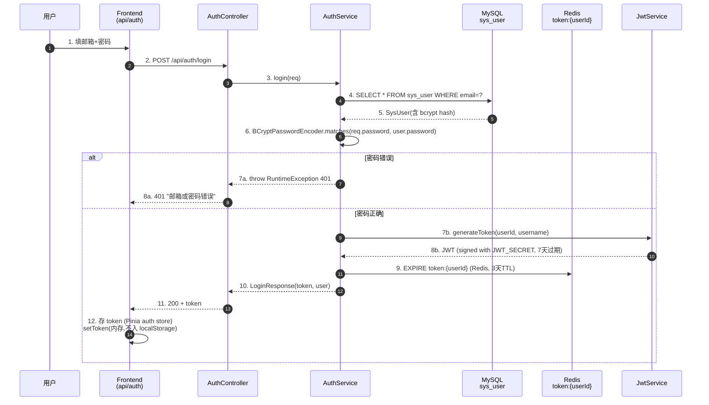
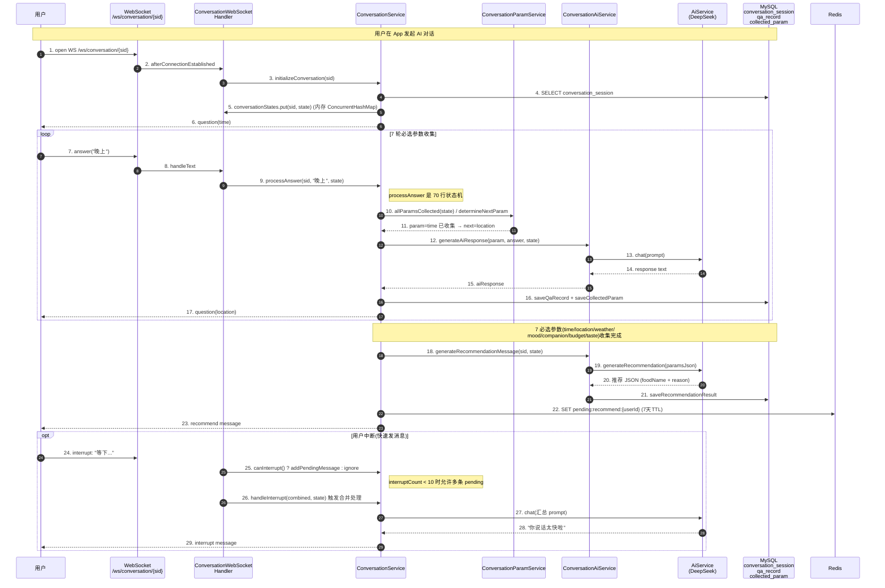
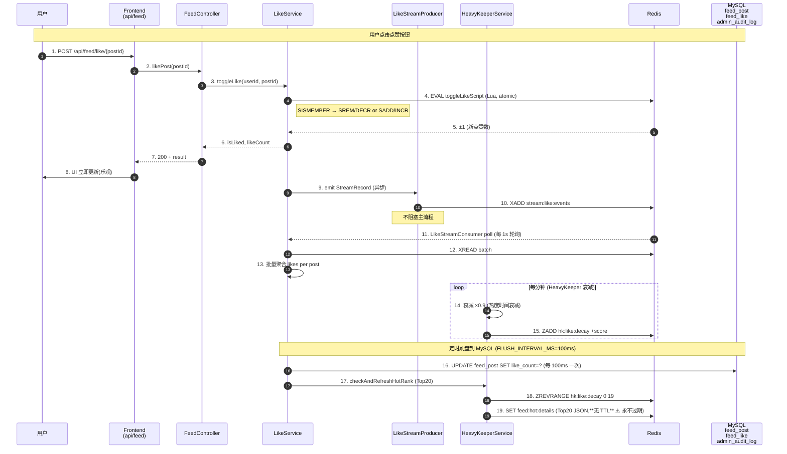
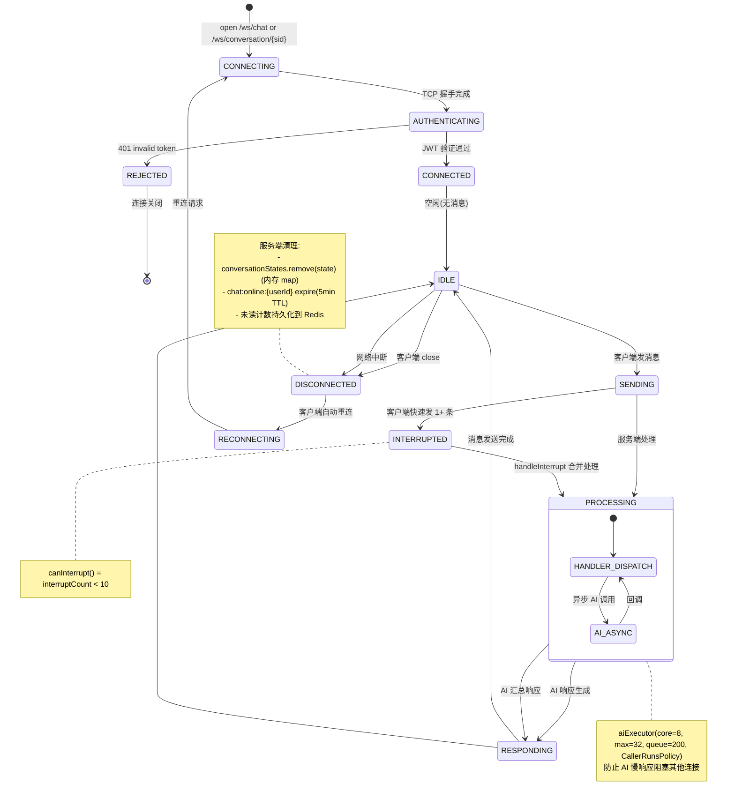

# AI-Food 架构图与核心流程

> 5 个 Mermaid 图,涵盖:架构 / 用户注册登录 / AI 对话 7 参数 / Feed 点赞+热榜 / WebSocket 会话生命周期。
> 用于下次 session 接手时快速理解项目结构。
> 评估期:Phase 5 of P1-finish-system-usable deepwork。

---

## 1. 系统架构图

```mermaid
graph TB
    subgraph 用户端
        Browser[浏览器]
    end

    subgraph 部署 (sandbox)
        Vite[vite preview<br/>:5174]
        Nginx[cloud nginx<br/>:80]
    end

    subgraph 远程 (cloud)
        CAdmin[admin-server.jar<br/>:8081]
    end

    subgraph 本机 (sandbox)
        MApp[ai-food-app.jar<br/>:8080]
        CCommon[ai-food-common<br/>JwtService / Mapper / Entity]
    end

    subgraph 数据层
        MySQL[(MySQL 8.x<br/>127.0.0.1:13306<br/>via SSH tunnel)]
        Redis[(Redis<br/>127.0.0.1:6379)]
    end

    Browser -->|HTTP| Nginx
    Nginx -->|/admin/*| Vite
    Nginx -->|/admin/api/*| CAdmin
    Nginx -->|/api/*| MApp

    MApp --> CCommon
    CAdmin --> CCommon
    CCommon --> MySQL
    CCommon --> Redis
    MApp -->|WebSocket<br/>/ws/chat /ws/conversation| Browser
```

**关键点**:
- admin-server 与 ai-food-app 共享 ai-food-common(JwtService / Mapper / Entity)
- AI 对话走 WebSocket(/ws/conversation/{sessionId}),聊天走 WebSocket(/ws/chat)
- 实时数据(LIKE / 未读 / 在线)走 Redis,持久数据走 MySQL
- cloud nginx 通过 SSH 隧道访问 sandbox 端口(119.29.52.111 是公网 IP,沙箱在 NAT 后面)

---

## 2. 用户注册登录流程



**关键点**:
- 密码用 BCrypt 加密(stored as `$2a$10$...`)
- JWT token 默认 7 天过期(JWT_EXPIRATION=604800000 ms)
- **Redis token 缓存 3 天 TTL**(AuthService.renewTokenTtl 主动续期)
- **Token 安全**:存入 Pinia 内存,不入 localStorage(XSS 防护);后端在 cookie 备份(2.0 引入)
- 限流:Caffeine 缓存 60s 内同邮箱/同 IP 1 次(防暴力)

---

## 3. AI 对话 7 参数收集(核心业务流)



**关键点**:
- **必选 7 参数**:time / location / weather / mood / companion / budget / taste(顺序敏感)
- **可选 3 参数**:restriction / preference / health(AI 自由发挥阶段补问)
- **状态机**:processAnswer 70 行本体留 facade(Oracle 修订),只 delegate 叶子调用
- **interrupted/interruptCount** 状态在 ConversationState,interruptCount >= 2 触发 AI 主动响应
- 推荐结果存 `recommendation_result` 表,7 天 TTL 在 Redis

---

## 4. Feed 点赞 + 热榜更新



**关键点**:
- **点赞原子性**:Redis Lua 脚本一次完成(查 / 增 / 减),不依赖事务
- **异步刷盘**:LikeStreamProducer → Redis Stream → LikeStreamConsumer 批量聚合,避免每次点赞都写 MySQL
- **热度算法**:HeavyKeeper(局部 LRU + Redis ZSet),每分钟 ×0.9 衰减
- **热榜缓存**:`feed:hot:details` 存 Top20 JSON,**⚠️ 无 TTL**(代码 bug,新点赞触发 refresh 但发布停止后永不刷新)

---

## 5. WebSocket 会话生命周期(Oracle 特别建议)



**关键点**:
- **2 个 WebSocket**:ChatWebSocketHandler(231行) + ConversationWebSocketHandler(299行)
- **JWT 鉴权**:`HandshakeInterceptor` 在握手时验证 Bearer token,principal 为 userId(String)
- **状态机**:每个连接有 `ConversationState` (per-session) 或 `chat message` 流(per-conversation)
- **线程池隔离**:AI 慢响应走 `aiExecutor`(8 core / 32 max / 200 queue),不阻塞 socket I/O
- **断线重连**:前端(aiFood 移动端)自动重连 + JWT 重发
- **心跳**:ChatWebSocketHandler 接受 `ping` action 回 `pong`,**无 server-side 5s 超时**(代码未实现)

---

## 6. 总结

5 个图覆盖:
- **架构**:3 个 backend 模块 + 2 个数据层 + 2 个部署层
- **用户流程**:注册登录(鉴权 / 限流 / bcrypt)
- **核心业务**:AI 对话 7 参数(状态机 + WebSocket)
- **高频操作**:Feed 点赞(原子 Lua + Stream 异步 + HeavyKeeper 热度)
- **实时通信**:WebSocket 生命周期(连接 / 鉴权 / 心跳 / 断线重连)
